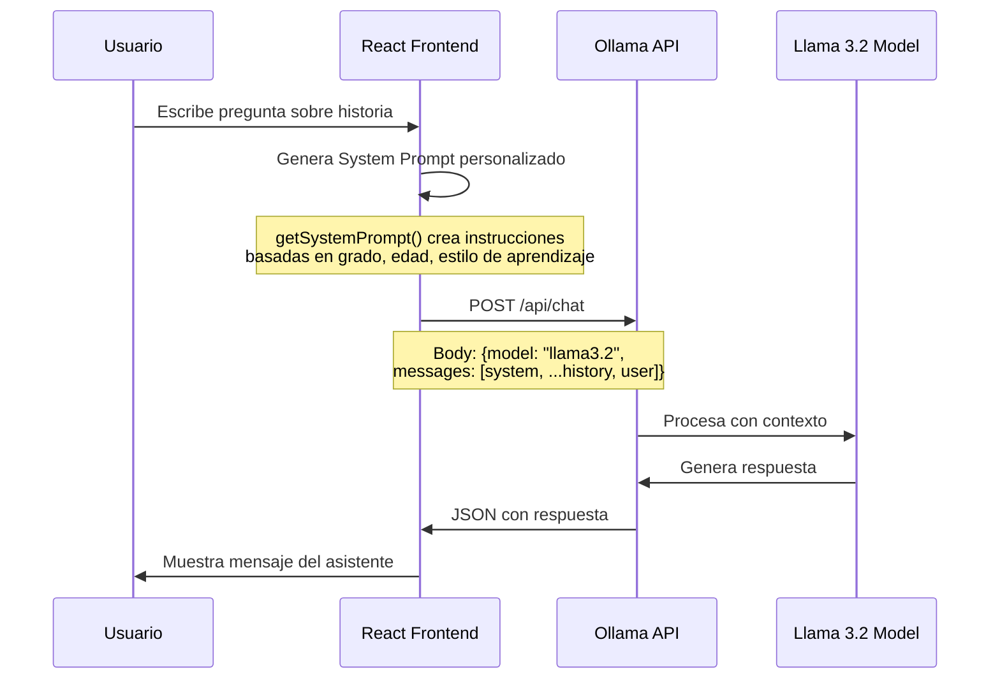
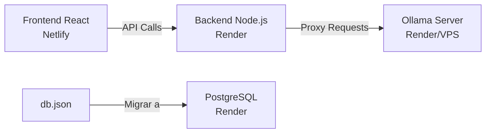

# 🏗️ Arquitectura del Proyecto: Historia de Venezuela - Chatbot Educativo

## 📋 Resumen Ejecutivo

Este es un proyecto educativo de **Historia de Venezuela** para niños de primaria (grados 1-6) que utiliza:
- **Frontend**: React + Vite + CoreUI (SPA - Single Page Application)
- **Backend Mock**: JSON Server (base de datos simulada con `db.json`)
- **IA/Chatbot**: Ollama con modelo Llama 3.2 (ejecutándose localmente)

---

## 🎯 ¿Qué "Magia" Estamos Usando?

### 1. **Frontend React (Cliente)**
- **Framework**: React 19 con Vite como bundler
- **UI Library**: CoreUI React (componentes de admin dashboard)
- **Routing**: React Router DOM v7
- **Estado**: React Context API para autenticación
- **Estilos**: SCSS + Bootstrap utilities

### 2. **Backend Simulado (JSON Server)**
- **Propósito**: Simula una API REST con un archivo JSON
- **Archivo**: `db.json` (contiene usuarios, temas, progreso, etc.)
- **Puerto**: 3001
- **Endpoints automáticos**: 
  - `GET /users`, `POST /users`, etc.
  - `GET /topics?grade_id=1`
  - `GET /progress`, etc.

### 3. **Chatbot con Ollama (IA Local)**
- **Modelo**: Llama 3.2 (ejecutándose en tu máquina)
- **API**: Ollama expone una API REST en `http://localhost:11434`
- **Endpoint usado**: `/api/chat`
- **Formato**: Envía mensajes + system prompt, recibe respuestas

---

## 🔄 Flujo de Datos del Chatbot



---

## 📂 Estructura del Proyecto

```
frontend/
├── src/
│   ├── components/
│   │   ├── PersonalizedContent.jsx  ← 🤖 CHATBOT PRINCIPAL
│   │   ├── AppSidebar.js
│   │   └── ...
│   ├── views/pages/
│   │   ├── home/HomePageCoreUI.js   ← 🏠 Página de inicio
│   │   ├── student/
│   │   └── chatbot/
│   ├── context/
│   │   └── AuthContext.js           ← 👤 Manejo de usuarios
│   ├── _nav_student.js              ← 📚 Navegación del estudiante
│   └── routes.js
├── db.json                          ← 💾 Base de datos simulada
├── .env                             ← 🔑 Variables de entorno
└── package.json
```

---

## 🧠 Código Clave del Chatbot

### `PersonalizedContent.jsx` - Componente Principal

```javascript
// 1️⃣ Función que genera el System Prompt dinámicamente
const getSystemPrompt = () => {
    if (!currentUser || !allowedTopics) return "";
    
    // Personaliza según estilo de aprendizaje (Visual, Auditivo, Kinestésico)
    const getLearningStyleInstructions = () => { /* ... */ };
    
    return `Eres un profesor de Historia de Venezuela...
    - Grado: ${allowedTopics.grade_name}
    - Edad: ${allowedTopics.edad_objetivo}
    - Temas permitidos: ${allowedTopics.temas.join(', ')}
    - Estilo: ${currentUser.learning_style}
    ...`;
};

// 2️⃣ Función que envía mensajes a Ollama
const handleSendMessage = async (e) => {
    // Preparar historial de conversación
    const historyForOllama = messages.map(msg => ({
        role: msg.role,
        content: msg.content
    }));
    
    // Llamar a Ollama API
    const response = await fetch(import.meta.env.VITE_OLLAMA_URL, {
        method: 'POST',
        headers: { 'Content-Type': 'application/json' },
        body: JSON.stringify({
            model: "llama3.2",
            messages: [
                { role: "system", content: getSystemPrompt() },
                ...historyForOllama,
                { role: "user", content: userMessage }
            ],
            stream: false
        })
    });
    
    const data = await response.json();
    // Mostrar respuesta en la UI
};
```

### Variables de Entorno (`.env`)

```bash
VITE_OLLAMA_URL=http://localhost:11434/api/chat
```

---

## 🚀 Despliegue en Producción (Netlify + Render)

### ⚠️ **PROBLEMA ACTUAL**
Ollama está corriendo **localmente** en tu máquina (`localhost:11434`). Esto NO funcionará en producción porque:
- Netlify solo sirve archivos estáticos (frontend)
- No puede ejecutar Ollama (que es un servidor de IA)

### ✅ **SOLUCIÓN: Arquitectura de 3 Capas**



---

## 🛠️ Plan de Deployment Paso a Paso

### **Opción 1: Backend Intermedio (Recomendado)**

#### 1. **Frontend en Netlify** (Gratis)
- Sube tu carpeta `frontend/` a GitHub
- Conecta Netlify a tu repo
- Build command: `npm run build`
- Publish directory: `dist`
- Variables de entorno: `VITE_OLLAMA_URL=https://tu-backend.onrender.com/api/chat`

#### 2. **Backend Node.js en Render** (Gratis)
Crea un servidor Express que:
- Sirva los datos de `db.json` (o migra a PostgreSQL)
- Haga de proxy entre el frontend y Ollama
- Maneje autenticación y lógica de negocio

**Archivo**: `backend/server.js`
```javascript
const express = require('express');
const cors = require('cors');
const app = express();

app.use(cors());
app.use(express.json());

// Proxy a Ollama
app.post('/api/chat', async (req, res) => {
    const response = await fetch('http://ollama-server:11434/api/chat', {
        method: 'POST',
        headers: { 'Content-Type': 'application/json' },
        body: JSON.stringify(req.body)
    });
    const data = await response.json();
    res.json(data);
});

// Endpoints de db.json (migrar a base de datos real)
app.get('/users', (req, res) => { /* ... */ });
app.get('/topics', (req, res) => { /* ... */ });

app.listen(3000);
```

#### 3. **Ollama en Render/Railway/VPS**
- **Render**: Web Service con Docker
- **Railway**: Más fácil para Ollama
- **DigitalOcean/Linode**: VPS ($5/mes)

**Dockerfile para Ollama**:
```dockerfile
FROM ollama/ollama:latest
RUN ollama pull llama3.2
EXPOSE 11434
CMD ["ollama", "serve"]
```

---

### **Opción 2: API de IA Comercial (Más Simple)**

Reemplaza Ollama con una API cloud:
- **OpenAI GPT-4** (pago por uso)
- **Google Gemini** (gratis hasta cierto límite)
- **Anthropic Claude** (pago)

**Cambio en el código**:
```javascript
// En lugar de Ollama
const response = await fetch('https://api.openai.com/v1/chat/completions', {
    method: 'POST',
    headers: {
        'Authorization': `Bearer ${import.meta.env.VITE_OPENAI_KEY}`,
        'Content-Type': 'application/json'
    },
    body: JSON.stringify({
        model: "gpt-4",
        messages: [
            { role: "system", content: getSystemPrompt() },
            ...historyForOllama
        ]
    })
});
```

---

## 📝 Prompt para Otra IA

Si quieres que otra IA te ayude con el deployment, usa este prompt:

```
Tengo un proyecto educativo de React + Vite que usa:
1. Frontend: React 19 con CoreUI, autenticación con Context API
2. Backend simulado: JSON Server con db.json (usuarios, temas, progreso)
3. Chatbot: Ollama con Llama 3.2 corriendo en localhost:11434

El chatbot funciona así:
- El componente PersonalizedContent.jsx genera un System Prompt dinámico basado en:
  * Grado del estudiante (1-6)
  * Edad objetivo
  * Estilo de aprendizaje (Visual/Auditivo/Kinestésico)
  * Temas permitidos según el grado
- Envía peticiones POST a Ollama API con el historial de mensajes
- Ollama responde con texto generado por Llama 3.2

Quiero desplegar esto en producción usando:
- Frontend: Netlify
- Backend: Render (Node.js/Express)
- Base de datos: PostgreSQL en Render
- IA: [Ollama en Docker en Render] O [Migrar a OpenAI/Gemini]

¿Puedes ayudarme a:
1. Crear un servidor Express que sirva de backend
2. Migrar db.json a PostgreSQL
3. Configurar Ollama en Render con Docker (o sugerir alternativa)
4. Actualizar las variables de entorno del frontend
5. Configurar CORS y seguridad

Adjunto:
- package.json
- PersonalizedContent.jsx (componente del chatbot)
- db.json (estructura de datos)
- .env actual
```

---

## 🔧 Comandos Útiles

### Desarrollo Local
```bash
# Terminal 1: Frontend
npm start

# Terminal 2: JSON Server
npm run server

# Terminal 3: Ollama (si no está corriendo)
ollama serve
```

### Build para Producción
```bash
npm run build
# Genera carpeta dist/ para subir a Netlify
```

---

## 📊 Costos Estimados (Mensual)

| Servicio | Opción | Costo |
|----------|--------|-------|
| Frontend (Netlify) | Gratis | $0 |
| Backend (Render) | Free tier | $0 |
| Base de datos (Render PostgreSQL) | Free tier | $0 |
| Ollama en VPS (DigitalOcean) | Droplet básico | $5-12 |
| **O** OpenAI GPT-4 | Pay-as-you-go | ~$10-30 |
| **O** Google Gemini | Free tier | $0 |

**Recomendación**: Empieza con Gemini (gratis) o GPT-3.5-turbo (barato) para validar el proyecto.

---

## 🎓 Conceptos Clave para Entender

1. **System Prompt**: Instrucciones iniciales que le das a la IA para que sepa cómo comportarse
2. **Context Window**: El historial de mensajes que la IA "recuerda"
3. **Streaming vs Non-streaming**: 
   - Streaming: Respuesta palabra por palabra (como ChatGPT)
   - Non-streaming: Respuesta completa de una vez (lo que usamos)
4. **CORS**: Configuración para que el frontend pueda llamar al backend desde otro dominio
5. **Environment Variables**: Secretos como API keys que no se suben a GitHub

---

## 📚 Recursos Adicionales

- [Ollama Docker Deployment](https://ollama.com/blog/ollama-is-now-available-as-an-official-docker-image)
- [Render Deployment Guide](https://render.com/docs/deploy-node-express-app)
- [Netlify React Deployment](https://docs.netlify.com/frameworks/react/)
- [OpenAI API Docs](https://platform.openai.com/docs/api-reference)
- [Google Gemini API](https://ai.google.dev/docs)

---

## ❓ Preguntas Frecuentes

**P: ¿Por qué no puedo usar Ollama directamente desde Netlify?**  
R: Netlify solo sirve archivos estáticos. Ollama necesita un servidor que ejecute el modelo de IA.

**P: ¿Es mejor Ollama o una API comercial?**  
R: 
- **Ollama**: Gratis, privado, pero requiere servidor propio
- **API comercial**: Más fácil de configurar, pago por uso, mantenido por terceros

**P: ¿Cómo migro de Ollama a OpenAI?**  
R: Solo cambia la URL del fetch y el formato del body (muy similar).

**P: ¿db.json funcionará en producción?**  
R: No, necesitas una base de datos real (PostgreSQL, MongoDB, etc.)

---

**Autor**: Proyecto educativo Historia de Venezuela  
**Fecha**: Febrero 2026  
**Stack**: React + Vite + CoreUI + Ollama/Llama 3.2
